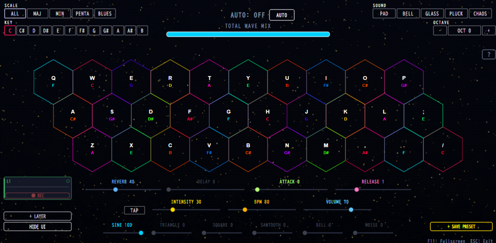

<div align="center">

# Ambient Tonnetz

### A hexagonal keyboard for making ambient music — right in your browser.

Press the hex grid and chords *just work*. No music theory, no install, no account. Layer loops, blend waveforms, drench it in reverb, and export the result as WAV.

**[▶ Try it live at tonnetz.sora16bit.com](https://tonnetz.sora16bit.com)**

[](https://tonnetz.sora16bit.com)
[](LICENSE)
[](https://vitejs.dev)
[](https://developer.mozilla.org/en-US/docs/Web/API/Web_Audio_API)
[](#contributing)

English · [日本語](docs/README.ja.md)

[](https://youtu.be/gcY16DrP3cQ)

<sub>▶ *Click to watch the demo on YouTube*</sub>



<sub>*The hex grid is a Tonnetz: neighbours are musical intervals, so notes that sit next to each other sound good together. Stack loops in the layer queue (bottom-left), shape the sound with the sliders, and the whole thing runs on the Web Audio API with no backend.*</sub>

</div>

---

## Table of contents

- [Why](#why)
- [What it does](#what-it-does)
- [Quick start](#quick-start)
- [How it works](#how-it-works)
- [Tech stack](#tech-stack)
- [Contributing](#contributing)
- [License](#license)

## Why

Most music tools assume you already know music. You're handed a piano roll, a key signature, and a blank timeline — and if you don't know which notes go together, you're stuck before you start.

A **Tonnetz** ("tone network") solves this with geometry instead of theory. It lays notes out on a hexagonal grid where adjacency *is* harmony: notes next to each other are consonant intervals, triangles are chords. So you can wander the grid, press whatever's nearby, and it sounds intentional. Ambient Tonnetz turns that grid into a playable instrument for drifting, loop-based ambient music — the kind you'd put under a stream, a study session, or nothing at all.

## What it does

- **🎹 Play a Tonnetz** — click, tap, or use the keyboard. Adjacent hexes are consonant, so there are no "wrong" notes. Pick a scale and root key to constrain it further.
- **🔁 Layer loops** — record what you play into independent looping layers and stack as many as you like to build evolving ambient textures.
- **🎛️ Shape the sound** — blend oscillator waveforms, set BPM, and dial in reverb, delay, and attack/release envelopes in real time.
- **🤖 Auto mode** — let it play itself and generate a self-evolving ambient bed, hands-free.
- **💾 Presets** — save, rename, and export your sound setups to JSON; share a patch via URL.
- **📤 WAV export** — bounce any layer to a `.wav` file.
- **🌍 Bilingual UI** — English and 日本語, switchable in the help panel.

No account, no backend, no install — everything runs client-side in the browser, and presets live in your own `localStorage`.

## Quick start

The fastest way is the **[live demo](https://tonnetz.sora16bit.com)** — nothing to install. Desktop is recommended (mobile is a landscape-only lite experience). Press a few hexes, hit record on a layer, and add another loop on top.

To run it locally (Node.js 20+):

```bash
git clone https://github.com/sora16bit/ambient-tonnetz.git
cd ambient-tonnetz
npm install
npm run dev
```

Then open <http://localhost:5173>.

```bash
npm run build    # production build to dist/
npm test         # run the vitest suite
```

## How it works

```
pointer / keyboard / auto-mode
            │
            ▼
   src/main.js  (input → state → render loop)
            │
   ┌────────┴─────────┐
   ▼                  ▼
src/audio/         src/ui/
  engine.js          canvas.js   ← all rendering is hand-drawn on a <canvas>
  drone.js           layerqueue.js
  recorder.js        presetpanel.js
            │
            ▼
     Web Audio API  (oscillators · convolution reverb · delay · gain envelopes)
            │
            ▼
   MediaRecorder → WAV export
```

- **Rendering** is a single `<canvas>` 2D draw loop — the hex grid, sliders, layer cards, and overlays are all drawn by hand (`src/ui/`), no DOM framework.
- **Sound** is pure Web Audio: oscillators per voice, a convolution reverb, a feedback delay, and per-note attack/release envelopes (`src/audio/`).
- **State** is a single plain object in `src/core/state.js`; input handlers mutate it and the render loop reads it.
- **Persistence** is `localStorage` for presets and language; patches can also be encoded into a shareable URL (`src/pro/url-share.js`).

## Tech stack

| Layer | Choice |
|---|---|
| Build | Vite (vanilla JS, ES2020, no framework) |
| Audio | Web Audio API (oscillators, convolution reverb, delay, envelopes) |
| Recording | MediaRecorder → custom WAV encoder |
| Rendering | Canvas 2D, hand-drawn UI |
| i18n | Hand-rolled string table (`src/i18n/strings.js`) |
| Tests | Vitest + jsdom |
| Hosting | Cloudflare Pages (static) |

## Contributing

Issues and PRs are welcome. The codebase is small, dependency-light vanilla JS — a good place to poke around. Run `npm test` before opening a PR.

## License

[MIT](LICENSE)
